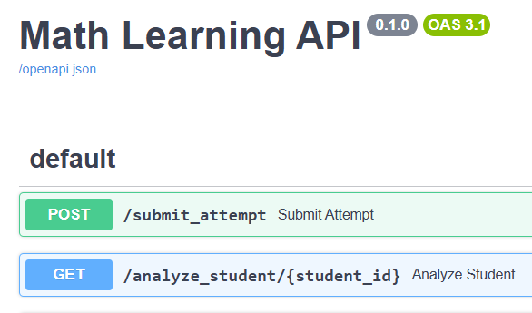

# PythonSmartKids
PythonSmartKids


# Math Learning API

This project provides an API for tracking kids' math learning progress and using AI to suggest personalized questions.

## Features
- Submit math question attempts.
- Store attempts in a database.
- Use AI to analyze performance and suggest practice questions.

## Setup

1. Install dependencies:

    ```sh
    pip install -r requirements.txt
    ```

2. Initialize the database:

    ```sh
    python app/db/db_init.py
    ```

3. **Install Additional Dependencies** (if needed):

    ```sh
    pip install psycopg2-binary
    ```

4. **Run the API Server**:

    For development with virtual environment:
    ```sh
    # Activate virtual environment first (if not already activated)
    Scripts\Activate.ps1

    # Run the server using the virtual environment Python
    Scripts\python.exe -m uvicorn app.main:app --reload --host 127.0.0.1 --port 8000
    ```

    Or using standard uvicorn (if globally installed):
    ```sh
    uvicorn app.main:app --reload --host 127.0.0.1 --port 8000
    ```

    **Server Access**:
    - **Main API**: http://127.0.0.1:8000/
    - **Interactive API Docs (Swagger)**: http://127.0.0.1:8000/docs
    - **Alternative Docs (ReDoc)**: http://127.0.0.1:8000/redoc

4. **API Endpoints**:

    The API provides several endpoints for math learning functionality:

    ### Core Endpoints

    | Method | Endpoint | Description |
    |--------|----------|-------------|
    | `POST` | `/submit_attempt` | Submit a student's math question attempt for storage |
    | `GET` | `/analyze_student/{uid}` | Get AI-powered analysis for student's weak areas |
    | `POST` | `/generate-questions` | Generate personalized practice questions |
    | `GET` | `/question-patterns` | Retrieve all available question patterns |

    ### Endpoint Details

    #### `POST /submit_attempt`
    Submit a student's answer to a math question for tracking and analysis.
    
    **Request Body**: `MathAttempt` schema
    ```json
    {
        "student_id": 123,
        "uid": "firebase-user-uid",
        "datetime": "2025-08-26T10:30:00",
        "question": "What is 2 + 3?",
        "is_answer_correct": true,
        "incorrect_answer": null,
        "correct_answer": "5"
    }
    ```

    #### `GET /analyze_student/{uid}`
    Get AI analysis of student performance and recommendations.
    
    **Response**: AI-generated analysis with weak areas and suggestions

    #### `POST /generate-questions`
    Generate new practice questions based on student's history.
    
    **Request Body**: `GenerateQuestionsRequest` schema
    ```json
    {
        "uid": "firebase-user-uid",
        "ai_bridge_base_url": "optional-custom-url",
        "ai_bridge_api_key": "optional-custom-key",
        "ai_bridge_model": "optional-custom-model"
    }
    ```

    #### `GET /question-patterns`
    Retrieve all available question patterns for question generation.
    
    **Response**: Array of question patterns with type and pattern text

    ### Interactive Documentation
    - **Swagger UI**: Available at `http://127.0.0.1:8000/docs` when running locally
    - **ReDoc**: Available at `http://127.0.0.1:8000/redoc` for alternative documentation view


Project Structure
```
my_project/
│── src/                     # Source code lives here
│   ├── main.py              # Entry point of the application
│   ├── config.py            # Configuration settings
│   ├── app/                 # Core application logic
│   │   ├── __init__.py
│   │   ├── services/        # Business logic layer
│   │   │   ├── __init__.py
│   │   │   ├── user_service.py
│   │   │   ├── order_service.py
│   │   ├── models/          # Data models (SQLAlchemy, Pydantic, etc.)
│   │   │   ├── __init__.py
│   │   │   ├── user.py
│   │   │   ├── order.py
│   │   ├── repositories/    # Data access layer (Repository Pattern)
│   │   │   ├── __init__.py
│   │   │   ├── user_repo.py
│   │   │   ├── order_repo.py
│   │   ├── routes/          # API Routes / Controllers
│   │   │   ├── __init__.py
│   │   │   ├── user_routes.py
│   │   │   ├── order_routes.py
│   ├── utils/               # Utility functions and helpers
│   │   ├── __init__.py
│   │   ├── logger.py
│   │   ├── validators.py
│   ├── db/                  # Database setup and migrations
│   │   ├── __init__.py
│   │   ├── db_session.py
│── tests/                   # Unit and integration tests
│   ├── __init__.py
│   ├── test_user.py
│   ├── test_order.py
│── scripts/                 # Deployment and automation scripts
│   ├── setup_db.py
│   ├── run_server.py
│── .env                     # Environment variables 
│── requirements.txt         # Python dependencies
│── Dockerfile               # Docker configuration
│── .gitignore               # Ignore files for Git
│── README.md                # Project documentation
```


# .env
- A plain text file that contains key-value pairs of environment variables.
- Used to store sensitive information (e.g., database URLs, API keys).
- Prevents hardcoding secrets in the source code.
- Add .env to .gitignore to prevent committing secrets

## Environment Variables Configuration

The application uses environment variables for configuration management. These can be set in the `.env` file for local development or as system environment variables in production.

### Database Configuration

| Variable | Default | Description |
|----------|---------|-------------|
| `DATABASE_PROVIDER` | `neon` | Database provider (currently only 'neon' supported) |
| `DATABASE_URL` | `""` | Full database connection URL |
| `NEON_DBNAME` | `smartboydb` | Neon PostgreSQL database name |
| `NEON_USER` | `tuanapp` | Neon database username |
| `NEON_PASSWORD` | `HdzrNIKh5mM1` | Neon database password |
| `NEON_HOST` | `ep-sparkling-butterfly-...` | Neon database host |
| `NEON_SSLMODE` | `require` | SSL mode for database connection |

### Backend Logic Configuration

| Variable | Default | Description |
|----------|---------|-------------|
| `MAX_ATTEMPTS_HISTORY_LIMIT` | `20` | **Maximum number of historical attempts to retrieve from database. Controls how many recent student attempts are fetched for analysis and display. Useful for performance optimization and limiting data transfer.** |

### AI Service Configuration

| Variable | Default | Description |
|----------|---------|-------------|
| `OPENAI_BASE_URL` | `https://openrouter.ai/api/v1/` | OpenAI API base URL |
| `OPENAI_API_KEY` | `""` | OpenAI API key |
| `OPENAI_MODEL` | `""` | OpenAI model to use |
| `FORGE_BASE_URL` | `https://api.forge.tensorblock.co/v1` | AI Bridge (Forge) API base URL |
| `FORGE_API_KEY` | `""` | AI Bridge API key |
| `FORGE_AI_MODEL` | `Gemini/models/gemini-2.0-flash` | AI Bridge model to use |

### Application Configuration

| Variable | Default | Description |
|----------|---------|-------------|
| `HTTP_REFERER` | `https://github.com/tuanna0308/PythonSmartKids` | HTTP referer for API requests |
| `APP_TITLE` | `PythonSmartKids` | Application title |

### Testing Configuration

| Variable | Default | Description |
|----------|---------|-------------|
| `RUN_REAL_API_TESTS` | `False` | Enable/disable tests that make real API calls |

### Configuration Examples

#### Local Development (.env file)
```bash
# Database query optimization
MAX_ATTEMPTS_HISTORY_LIMIT=20

# For testing with more data
MAX_ATTEMPTS_HISTORY_LIMIT=100

# For production with performance considerations
MAX_ATTEMPTS_HISTORY_LIMIT=50
```

#### Production Environment Variables
```bash
# Set via system environment or deployment platform
export MAX_ATTEMPTS_HISTORY_LIMIT=50
export DATABASE_PROVIDER=neon
export RUN_REAL_API_TESTS=False
```

## Deployment Configuration

### Production Deployment Considerations

1. **Environment Variables Security**:
   - Never commit `.env` files to version control
   - Use secure environment variable management in production
   - Rotate API keys regularly

2. **Database Configuration**:
   - Use connection pooling for better performance
   - Configure appropriate `MAX_ATTEMPTS_HISTORY_LIMIT` based on your data volume
   - Monitor database performance and adjust limits accordingly

3. **Performance Optimization**:
   ```bash
   # For high-traffic applications
   MAX_ATTEMPTS_HISTORY_LIMIT=25
   
   # For detailed analysis requirements
   MAX_ATTEMPTS_HISTORY_LIMIT=100
   
   # For development/testing
   MAX_ATTEMPTS_HISTORY_LIMIT=10
   ```

4. **Monitoring**:
   - Monitor API response times
   - Track database query performance
   - Set up alerts for failed attempts

### Current Deployment Status

| Platform | Status | URL |
|----------|--------|-----|
| **Production** | ✅ Active | [Vercel Deployment](https://vercel.com/tuans-projects-b937be10/python-smart-kids) |
| **Railway** | ✅ Active | [Railway Deployment](https://pythonsmartkids-production.up.railway.app/docs) |
| **Database** | ✅ Active | [Neon PostgreSQL](https://console.neon.tech/app/projects/dark-hill-03559036) |
| **Local Dev** | 🟡 Manual | `http://127.0.0.1:8000/` |

### Frontend Integration

| Platform | Repository | Status |
|----------|------------|--------|
| **Android App** | [SmartBoy_Capacitor](https://github.com/tuanapp/SmartBoy_Capacitor) | ✅ Published on Google Play Store |
| **Local Dev** | `C:\Private\GIT\SmartBoy_Capacitor_2` | 🟡 Development |


---

### **Project Overview:**
"This project follows an industry-level, well-structured folder design with best practices. It consists of two primary API endpoints:  
1. **Data Collection API** – Accepts student responses to randomly generated math questions.  
2. **AI Analysis API** – Analyzes student performance using an AI model and generates targeted practice questions based on weak areas.  

The system ensures **scalability, modularity, and clean architecture**, making it easy to maintain and expand."

---

### **Project Folder Structure**
"The project is organized as follows:  

- **`src/`** – Contains all source code files.  
  - **`api/`** – The main API implementation.  
    - `main.py` – Entry point for the FastAPI-based application.  
    - `routes/` – Defines the API endpoints.  
  - **`services/`** – Business logic handling.  
  - **`models/`** – Defines the data models used for database interactions.  
  - **`database/`** – Handles database connection and queries.  
  - **`ai/`** – Responsible for AI-powered analysis using Qwen API.  
  - **`utils/`** – Utility functions for common tasks.  
- **`tests/`** – Includes unit and integration tests for API validation.  
- **`config/`** – Stores configuration files, including API keys and database settings.  
- **`docs/`** – Documentation for API usage and deployment.  

This structure ensures that our code is **modular, testable, and easy to scale**."

---

### **How It Works**
#### **Step 1: Collecting Student Responses**
"When a student answers a math question, the response is sent to our API with details such as:  
- Student ID  
- Firebase User UID (for user authentication and tracking) 
- Timestamp  
- Question  
- Whether the answer is correct or not  
- The incorrect answer (if any)  
- The correct answer  

This data is stored in our database for further analysis."

#### **Step 2: AI Analysis and Personalized Question Generation**
"When a teacher or system requests an analysis for a student, the API fetches all recorded responses and sends them to the **Qwen AI model**. The AI analyzes performance trends and identifies weak areas. Based on this, it generates a new set of personalized math questions to help the student improve in those areas."

#### **Step 3: Continuous Improvement**
"Since all student interactions are logged, the system continuously refines its question recommendations, creating a **personalized learning journey** for each student."

---

### **Key Technologies Used**
"This project is built using:  
- **FastAPI** – A modern and high-performance web framework.  
- **Qwen AI API** – For AI-powered student performance analysis.  
- **Pytest** – For automated testing.  
- **Docker** – For containerized deployment.  

All API endpoints are well-documented using **Swagger**, ensuring ease of integration with front-end applications."

---

### **Why This Matters**
"Our goal with this project is to provide an intelligent and adaptive math learning experience for kids. With AI-driven insights, we can help students strengthen their weak areas and improve their overall math proficiency in a structured and engaging way."

---

### **Next Steps**
"Our next steps include:  
1. **Finalizing API testing and optimization.**  
2. **Deploying the system for real-world usage.**  
3. **Enhancing AI analysis with more question types and difficulty levels.**  


#Deployments
Render.com - fails due to card not accepting for some reason - https://dashboard.render.com/web/new?newUser=true
railway.com -  success - https://pythonsmartkids-production.up.railway.app/docs - https://railway.com/project/7b2a55f8-4a56-443c-9e2d-91ed5e8c667f/service/4ad49022-6ac2-4675-a1c4-e69b3d69d3af?environmentId=928a35d5-6b21-4182-ab8e-1590766ccdec&id=73b675f7-2efd-4b30-96b7-0244c10077c6#build

Local:
http://127.0.0.1:8000/

#Tools Used

- Git CLI
https://cli.github.com/
- vs code extention: sqllite viwer

#Notes


# launch.json

```
{
    "version": "0.2.0",
    "configurations": [
        {
            "name": "Python: FastAPI",
            "type": "python",
            "request": "launch",
            "module": "uvicorn",
            "args": [
                "app.main:app",
                "--reload",
                "--host", "127.0.0.1",
                "--port", "8000",
                "--log-level", "debug"
            ],
            "env": {
                "PYTHONUNBUFFERED": "1"
            },
            "jinja": true,
            "justMyCode": false
        }
    ]
}

```

to debug all files > "justMyCode": false

or else below tooltip will appear when breakpoint hits
```
Breakpoint in file excluded by filters.
Note: may be excluded because of "justMyCode" option (default == true).Try setting "justMyCode": false in the debug configuration (e.g., launch.json).
```

### **FastAPI Summary 🚀**  

- **FastAPI** is a **high-performance, modern** Python web framework for building APIs.  
- **Key Features:**  
  - 🚀 **Blazing fast** (near Node.js & Go performance).  
  - ✅ **Asynchronous support** (async/await for non-blocking operations).  
  - 📜 **Automatic API docs** (Swagger UI & ReDoc).  http://127.0.0.1:8000/docs
  
  - 🔄 **Type hinting** for validation & serialization (via **Pydantic**).  
  - 🔌 **Dependency Injection** for scalable architectures.  
  - 🔒 **Built-in security** (OAuth2, JWT, API keys).  

- **Example Usage:**
  ```python
  from fastapi import FastAPI
  app = FastAPI()

  @app.get("/")
  async def read_root():
      return {"message": "Hello, FastAPI!"}
  ```

- **How to Run FastAPI:**  
  ```bash
  uvicorn main:app --reload
  ```
  - Visit **http://127.0.0.1:8000/docs** for auto-generated API documentation.

- **FastAPI vs Flask:**  
  - 🏎️ **Faster** than Flask (async support).  
  - ✅ **Type safety & validation** (Flask requires manual validation).  
  - 🔥 **Better scalability** for microservices & modern web apps.  

- **Best Use Cases:**  
  - REST APIs & microservices.  
  - High-performance applications.  
  - Machine learning API deployments.  


| **Rank** | **Framework**     | **Best For**                        | **Performance**   | **Async Support**  | **Learning Curve** | **Industry Use**                                | **Downsides** | **Popularity** |
|---------|-------------------|-----------------------------------|------------------|-------------------|-------------------|------------------------------------------------|-------------|--------------|
| **1️⃣** | **Flask** 🐍      | Simple APIs, microservices        | 🟡 Moderate      | ❌ No (Requires Flask-Async) | 🔹 Very Easy     | Popular for **startups, web services, microservices (Airbnb, Netflix, Lyft, Reddit)** | No **async** support, requires **extensions** for many features. | ⭐⭐⭐⭐⭐ Most Used |
| **2️⃣** | **Django REST Framework (DRF)** 🏛️ | Large-scale web apps, CMS | 🟡 Moderate | ❌ No (Requires Django-Channels) | 🔸 Medium | Used in **enterprise applications, fintech, social media (Instagram, Pinterest, Spotify)** | Heavy framework, **slower than FastAPI**, complex for small projects. | ⭐⭐⭐⭐⭐ Widely Used |
| **3️⃣** | **FastAPI** 🚀    | High-performance APIs, modern apps | ✅ Super Fast     | ✅ Built-in       | 🔹 Easy           | Used in **ML APIs, microservices, fintech, AI (Netflix, Uber, Stripe)** | Requires **Python 3.7+**, smaller ecosystem than Flask. | ⭐⭐⭐⭐ Rapid Growth |
| **4️⃣** | **Express.js** 🛠️ | JavaScript APIs, microservices     | ✅ Fast          | ✅ Yes           | 🔹 Easy          | Used in **backend services, fintech, e-commerce (Uber, PayPal, IBM, Twitter)** | **Not Python-based**, lacks type safety. | ⭐⭐⭐⭐⭐ JavaScript Standard |
| **5️⃣** | **Tornado** 🌪️   | Real-time apps (WebSockets, chat)  | ✅ Super Fast     | ✅ Full Async     | 🔺 Complex       | Used for **real-time applications, WebSockets, Quora, Facebook Chat** | Harder to learn, **less community support** than Flask/FastAPI. | ⭐⭐⭐ Specialized Use |
| **6️⃣** | **Sanic** 🏃‍♂️    | Fast async APIs (Flask-like)      | ✅ Fast          | ✅ Full Async     | 🔺 Medium        | Used in **low-latency APIs, async applications** | **Smaller ecosystem**, less adoption than Flask/FastAPI. | ⭐⭐ Niche Adoption |
| **7️⃣** | **Falcon** 🦅     | Minimalist APIs, microservices     | ✅ Fast          | ❌ No            | 🔺 Medium        | Used in **cloud services, LinkedIn, OpenStack** | No built-in **ORM**, lacks async support, **fewer libraries**. | ⭐ Less Popular |

---

### **📌 Key Takeaways**
✅ **Most Used & In-Demand** → **Flask & Django REST Framework**  
✅ **Fastest Growing** → **FastAPI (rising in industry demand)**  
✅ **Best for Async Apps** → **FastAPI, Tornado, Sanic**  
✅ **Best for Large Enterprise Apps** → **Django REST Framework**  
✅ **Best for Real-Time WebSockets** → **Tornado**  
✅ **Most Used Outside Python** → **Express.js (Node.js)**  

### 
New Problem Statement for next version of my app

Context: Currently i am having a front end which an android app in the google play store.

a. Types & Patterns
All Question Types & Patterns should be updated and maintainable in a single source of truth in any suitable format.

examples:
type: algebra , pattern 1 : a + b = _
type: fraction , pattern 2 : 3 / 2 = _

b. Templates - Grouping of questions and parameters such difficulty, Subject, subtopic
They should be stored in diffferent Templates. So, that for each template we can group certain types and patterns of Questions. Also we can increaes the difficulty level for each Template.

examples:
subject: maths
template: simple algebra & fractions
difficulty: grade 5 Level 1

c. Historical data (if available)
examples: students wrong answers & its questions

d. Based on the a, b, c => send a request to a AI model API & get a response. Using the response, create a New Random Question paper for all given Question types & patterns.
it should display the question with a question number and also provide a user input for the user to enter the answer.

e. Once user answers the question. When the "Check Answers" button is clicked, it should display the user if the answer is correct on wrong. also show the correct answer if its wrong. and save the user entered answers aginst the studentId in a database which will be later used in (c)


Free Hosted Deployments:
1. Andrid frontend
code @ https://github.com/tuanapp/SmartBoy_Capacitor
hosted @ playstore
dev @ C:\Private\GIT\SmartBoy_Capacitor_2
2. 
Python backend API - https://github.com/tuanapp/PythonSmartKids
hosted @ https://vercel.com/tuans-projects-b937be10/python-smart-kids
Database 
hosted @ https://console.neon.tech/app/projects/dark-hill-03559036/branches/br-withered-block-05263935/tables?database=smartboydb
dev @ C:\Private\GIT\PythonSmartKids


I've successfully added the RUN_REAL_API_TESTS environment variable to your project. Here's what I did:

Added the variable to your .env file with a default value of False:
# Testing Configuration
RUN_REAL_API_TESTS=False

Updated your config.py file to load and properly convert this environment variable to a boolean:
# Testing settings
RUN_REAL_API_TESTS = os.getenv("RUN_REAL_API_TESTS", "False").lower() == "true"

Added a new real marker to your pytest.ini file so you can easily run just the real API tests using the command:
python -m pytest -m real -v

Updated your test_ai_service_real.py file to use the environment variable from the config file rather than directly checking os.environ.

Now when you want to run tests that make actual API calls, you have two options:

Temporary change: Change RUN_REAL_API_TESTS=False to RUN_REAL_API_TESTS=True in your .env file and run:
python -m pytest -m real -v

Command-line override: Keep the value as False in the .env file and override it at run time:
# Windows Command Prompt
set RUN_REAL_API_TESTS=True && python -m pytest -m real -v

# PowerShell
$env:RUN_REAL_API_TESTS="True"; python -m pytest -m real -v

This approach ensures that your real API tests won't accidentally run and consume your API quota during normal development and CI/CD workflows.

## Testing

The project uses a comprehensive testing framework with organized test categories for better maintainability and development workflow.

### Test Organization

Tests are organized in the `tests/` directory with the following structure:

```
tests/
├── unit/           # Unit tests for isolated components
├── integration/    # Integration tests for multiple components
├── e2e/           # End-to-end tests for full system
├── real/          # Tests that use real external services
├── manual/        # Manual test scripts for development
└── fixtures/      # Test data and fixtures
```

### Running Tests

#### Run All Tests
```bash
python -m pytest
```

#### Run Tests by Category
```bash
# Unit tests only (fast, isolated)
python -m pytest tests/unit/ -v

# Integration tests (multiple components)
python -m pytest tests/integration/ -v

# Real API tests (requires API credentials)
python -m pytest tests/real/ -v

# Manual development tests
python -m pytest tests/manual/ -v
```

#### Run Tests by Markers
```bash
# Run only unit tests
python -m pytest -m unit -v

# Run only integration tests
python -m pytest -m integration -v

# Run tests that don't require external services
python -m pytest -m "not real" -v

# Run slow tests
python -m pytest -m slow -v

# Run Neon database tests
python -m pytest -m neon -v
```

### Test Categories Explained

- **Unit Tests**: Test individual components in isolation with mocked dependencies
- **Integration Tests**: Test multiple components working together
- **Real Tests**: Test actual external API calls (requires credentials)
- **Manual Tests**: Development scripts for testing specific scenarios
- **E2E Tests**: Full system tests from user perspective

### Environment Setup for Testing

For tests that require external services:

1. **Real API Tests**: Set `RUN_REAL_API_TESTS=True` in `.env` file or override at runtime:
   ```bash
   # PowerShell
   $env:RUN_REAL_API_TESTS="True"; python -m pytest -m real -v
   ```

2. **Database Tests**: Ensure database connection strings are properly configured in your environment

### Test Configuration

The testing framework uses:
- `pytest.ini` for main configuration
- `tests/conftest.py` for shared fixtures and pytest setup
- `tests/pytest_fixtures.py` for reusable test fixtures

See `tests/README.md` for detailed information about test organization and best practices.

## Documentation

All project documentation is organized in the [`docs/`](docs/) folder for better maintainability:

### 📚 Available Documentation

- **[`docs/DATABASE_README.md`](docs/DATABASE_README.md)** - Database setup, configuration, and operations
- **[`docs/TEST_MIGRATION_COMPLETE.md`](docs/TEST_MIGRATION_COMPLETE.md)** - Complete test organization migration report
- **[`docs/TEST_ORGANIZATION_PLAN.md`](docs/TEST_ORGANIZATION_PLAN.md)** - Test migration planning documentation
- **[`docs/VERCEL_DEPLOYMENT.md`](docs/VERCEL_DEPLOYMENT.md)** - Vercel deployment configuration and setup
- **[`docs/WORKSPACE_STRUCTURE.md`](docs/WORKSPACE_STRUCTURE.md)** - Project workspace organization and structure

### 📖 Quick Access

For comprehensive documentation overview and navigation, see **[`docs/README.md`](docs/README.md)**.


TODO
---
- max questions to generate needs to be passed as a parameter from client end 
  - max questoin generation limit must also be sent in backend to prevent throttling.